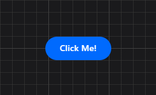
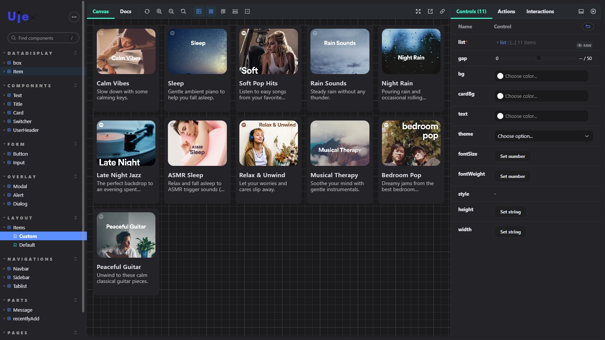

<p align="center">
  <a href="https://github.com/aminbenz/ujex/">
    
  </a>
</p>

<h1 align="center">Build buity React Apps with Speed ⚡️</h1>

<br>

Ujex is an open-source Ujex UI library is a collection of materials, & components that are easy to use support multi-themes & that you can readily use or modify to meet your needs.

[Learn how to use Ujex in your project][docs].

## Installation

To use Ujex components, all you need to do is install the
`@aminbenz/ujex` package and its peer dependencies:

1. Install package

```sh
npm i @aminbenz/ujex
# or
yarn add @aminbenz/ujex
```

## Usage

To start using the components, please follow these steps:

2. Import Component

```tsx
import { Button } from '@aminbenz/ujex';

const Home = () => {
  return (
    <Button size="md" color="primary">
      Click Me!
    </Button>
  );
};

export default Home;
```



- Use [Online Playgrounds][docs] to get a taste of Ujex.

## Documentation

You can find the Ujex documentation [on the website][ujex].

Check out the [Getting Started][docs] page for a quick overview.

<!-- The documentation is divided into several sections:

- [Tutorial](https://ujex.io/tutorial/tutorial.html)
- [How to use Components](https://ujex.io/docs/components)
- [API Reference](https://ujex.io/docs/react-api.html)
- [Where to Get Support](https://ujex.io/community/support.html)
- [Contributing Guide](https://ujex.io/docs/how-to-contribute.html) -->

## Examples

We have several examples [on the website][ujex]. Here is the first one to get you started:

```tsx
import { Items } from '@aminbenz/ujex';

const Cards = () => {
  return (
    <Items
        list={[
          {
            id: '37i9dQZF1DX1s9knjP51Oa',
            title: 'Calm Vibes',
            description: 'Slow down with some calming keys.', //optional
            image: 'https://i.scdn.co/image/001', //optional
          },
          {
            id: '37i9dQZF1DWZd79rJ6a7lp',
            title: 'Sleep',
            description: 'Gentle ambient piano to help you fall asleep.',
            image: 'https://i.scdn.co/image/002',
          },
          ...
        ]}
 />
  );
};

export default Cards;
```



This example will render "Cards with list of Data" into a container on the page.

i use typescript in this project so you have more strict way to play with components

<!-- ## Contributing

The main purpose of this repository is to continue evolving Ujex core, making it faster and easier to use. Read below to learn how you can take part in improving Ujex.

### [Contributing Guide](https://ujex.io/docs/how-to-contribute.html)

Read our [contributing guide](https://ujex.io/docs/how-to-contribute.html) to learn about our development process, how to propose bugfixes and improvements, and how to build and test your changes to Ujex.

### License

Ujex is [MIT licensed](./LICENSE) -->

[ujex]: https://ujex.vercel.app
[docs]: https://ujex.vercel.app
[source code]: https://github.com/aminbenz/ujex
